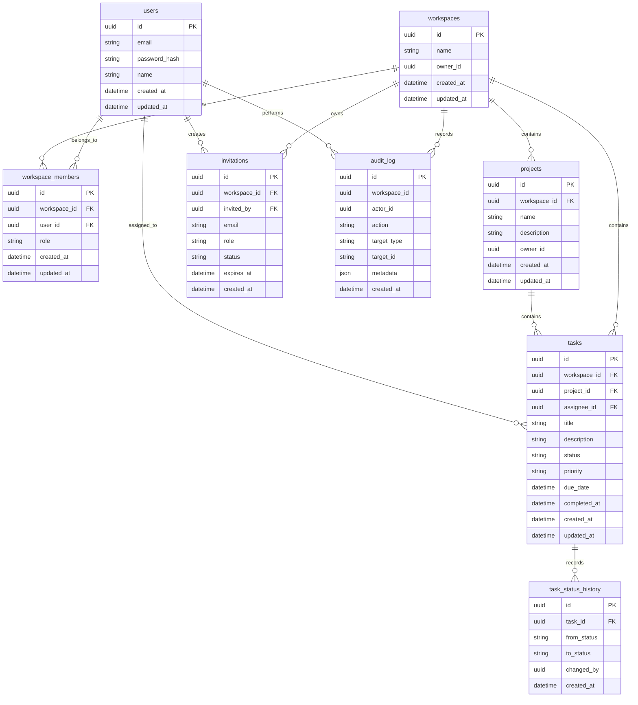

# CollabSpace ER Diagram — v2

## Scope

This diagram documents the current relational model relevant to the Day 48 security baseline.



## Audit Log Design

`audit_log` records security-sensitive and operationally important actions.

Important properties:

- `workspace_id` scopes the event to a workspace when applicable.
- `actor_id` identifies the user responsible for the action when available.
- `action` identifies the event.
- `target_type` identifies the affected resource category.
- `target_id` identifies the affected resource when applicable.
- `metadata` stores structured contextual information.
- `created_at` records event time.

Indexes:

```text
(workspace_id, created_at)
(actor_id, created_at)
(action, created_at)
```

These indexes support workspace timelines, actor activity, and action-oriented investigations.

## Audit Events

Current application audit events include:

```text
AUTH_REGISTER
AUTH_LOGIN
AUTH_LOGOUT

WORKSPACE_CREATED
WORKSPACE_DELETED

MEMBER_REMOVED

INVITATION_CREATED
INVITATION_ACCEPTED

PROJECT_CREATED
PROJECT_DELETED

TASK_CREATED
TASK_UPDATED
```

There is currently no role-change endpoint or task-delete endpoint in the application, so those actions are not logged as application events yet.

## Metadata Security

Audit metadata is sanitized before persistence.

Sensitive keys such as:

```text
password
token
secret
authorization
cookie
jwt
refresh
access
apiKey
credential
```

are replaced with:

```text
[REDACTED]
```

Bearer-token-shaped and JWT-shaped string values are also redacted.

The audit tests verify that raw secret values do not reach persisted metadata.
